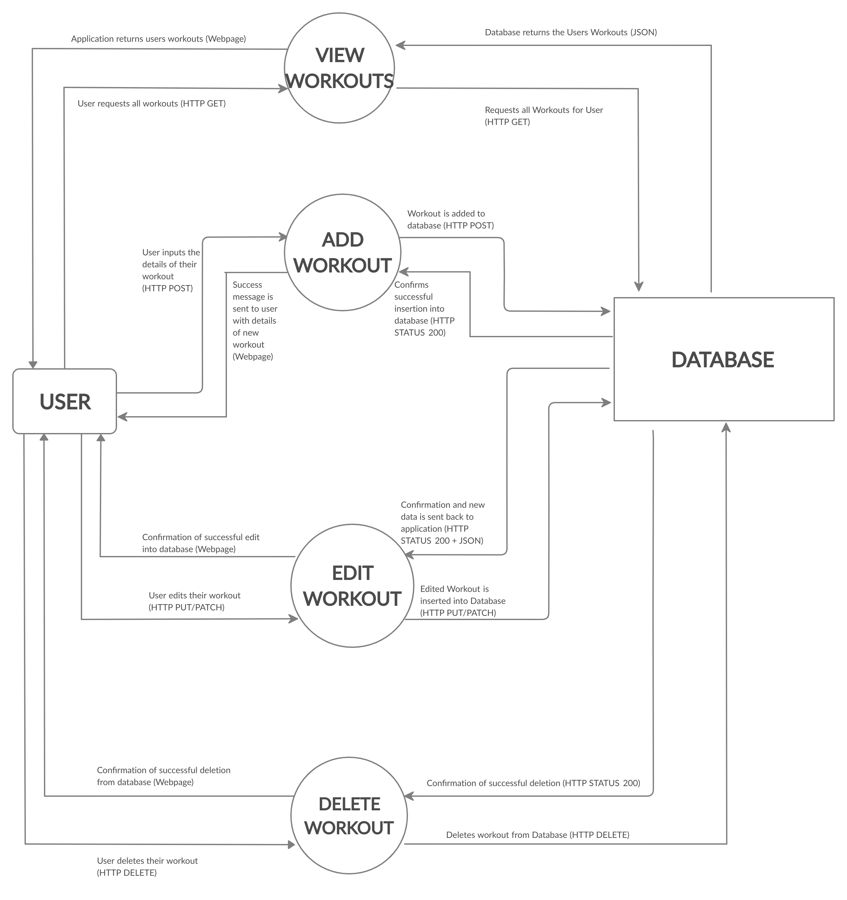

# Morgan Batterham T3A2-A

## Website Description

### Purpose

This website is used to track and plan workouts fitness enthusiasts. The current options for websites used for tracking workouts are quite lacking in their feature set for the end user and can be cumbersome to use. This website will track progression and improvements with additional easy to use graphical options to observe their progress. There is also the option for the website to automatically plan the rep and weight ranges for future workouts. 

The intent is to make the tedious and burdensome, yet critical, part of fitness easy in order to promote health and well-being. A key motivating factor of working out and continuing to work out is being able to see what you have already accomplished over a period of time since the progress made day-to-day or even week-to-week is sometimes hard to perceive.

Another key factor towards sticking with a workout plan is accountability and the platform will provide a number of methods to keep the user engaged and responsible for their workouts with other users and even their own personal trainers.

### Functionality/Features

The application is designed for the user to be able to create their own personal workout plan saved to the platform and editable at will. The user is then able to store their completed workouts and view their historical logs in a tabular format, as a graph, or just in a calendar form in order to view their progress and commitment to their plan.

These workout plans and logs are personal to each user and, as such, each user will have an account which will require a level of account creation, authentication, and permission. Providing a user's information to their trainer will also require multiple levels of end-user access. Should a user decide to share their logs to others there will be an export function available to them.

The user's historical logs will need to be stored but also be editable and deletable.

Providing a social aspect for a level of accountability will be accomplished through the creation of user groups and within these groups they will be able to set communicate and challenges to one-another. 

### Target Audience

The target audience for this website is anyone who has an interest in Health and Fitness. Specifically people interested in weightlifting, as the website is built to track reps and weights.

There will also be the option for trainers to access a client's data, to track their progress and assist in the planning of workouts. 

### Tech Stack

This website will be primarily built on the MERN stack:

- *MongoDB* will be used as the database; for the long term, persistent storage of Data.

- *ExpressJS* will be used as the web server, to receive and process HTTP requests.

- *ReactJS* will be used to build the 'front end' of the website. This is the portion that is loaded into the browser, in order to handle user interaction.

- *NodeJS* is a JavaScript runtime which will be used to run the ExpressJS code.

## Dataflow Diagram

## Application Architecture Diagram

## User Stories

- As a user, I want to track my past workouts

- As a user, I want a secure login so no one else can access my data

- As a user, I want the option to track my progress and improvements

- As a user, I want the option to plan my weights and progression

- As a user, I want regular reminders to workout

- As a user, I want an email reminder if I miss a workout

- As a user, I want to be able to add a new workout

## Wireframes

### Site Overview

### Landing Page

### Login

### Register

### Profile

### Past Workouts

### My Program

### Add Workout

## Trello Board Screenshots

### Start of Day 1

### End of Day 1

### End of Day 2
